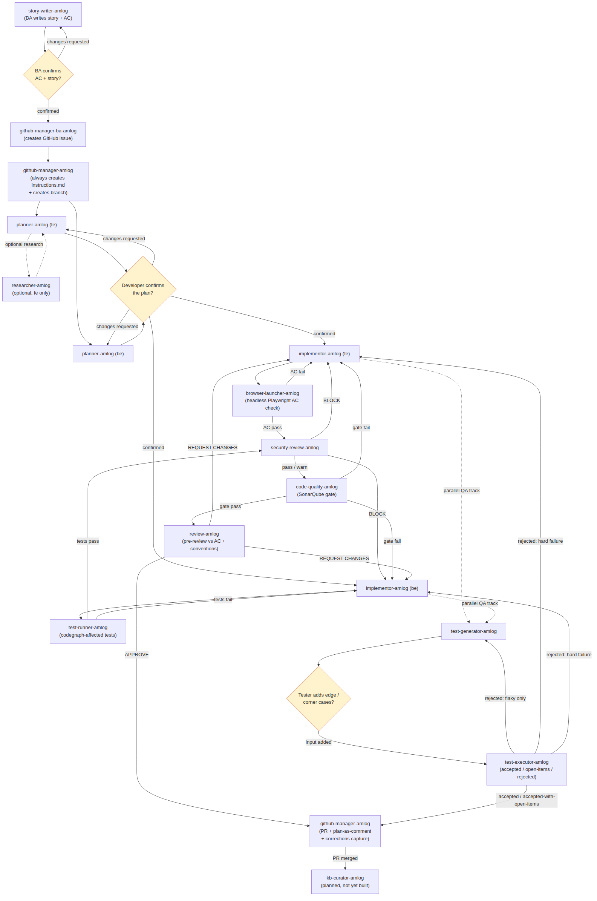
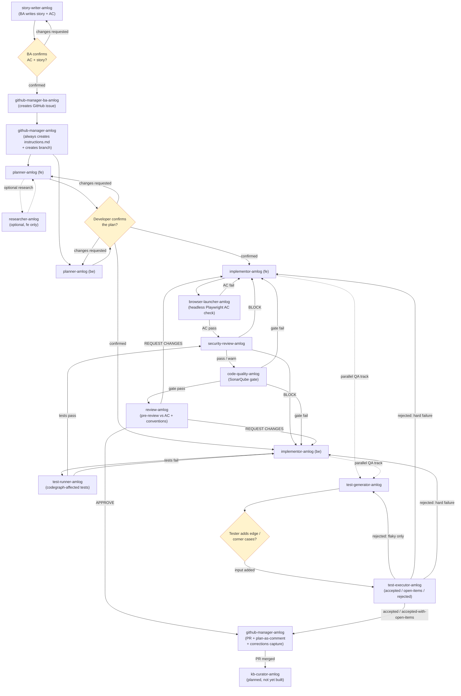

# amlog-workflow

**Agentic SDLC workflow toolkit** — installs role-specific AI agents and a [CodeGraph](https://github.com/colbymchenry/codegraph) knowledge base into any workspace, in one command.

[](https://www.npmjs.com/package/amlog-workflow)
[](LICENSE)

---

## Table of contents

- [What is amlog?](#what-is-amlog)
- [Installation](#installation)
- [Quick start](#quick-start)
- [Upgrading from a pre-native install](#upgrading-from-a-pre-native-install)
- [CLI reference](#cli-reference)
- [Updating](#updating)
- [Uninstalling](#uninstalling)
- [Diagnostics](#diagnostics)
- [Multi-zone repos](#multi-zone-repos-frontend--backend-in-one-repo)
- [Agent roster](#agent-roster)
- [How agents work](#how-agents-work)
- [Skills](#skills)
- [Agent flow: the full cycle](#agent-flow-the-full-cycle)
- [Human-in-the-loop gates](#human-in-the-loop-gates)
- [Self-improvement: agent history & retrospectives](#self-improvement-agent-history--retrospectives)
- [QA verdict model](#qa-verdict-model)
- [Implementation plan as an issue comment](#implementation-plan-as-an-issue-comment)
- [Status](#status)
- [Requirements](#requirements)
- [License](#license)
- [Contributing](#contributing)

---

## What is amlog?

`amlog` is a CLI that installs a curated set of role-specific AI agents **natively** into whichever AI coding tool(s) you use, alongside a live code-knowledge graph. Each agent is defined once in a shared registry (`registry/`) and converted into the exact subagent format each tool expects — no copy-pasting definitions between tools, no format mismatches, and no hand-maintained prose roster in `AGENTS.md`/`CLAUDE.md`.

In short, one command gives your AI coding assistant(s):
- A set of specialized subagents tuned to your role (planner, implementor, reviewer, test writer, etc.), each with its own scoped instructions and tool access.
- A [CodeGraph](https://github.com/colbymchenry/codegraph) index of your codebase, so agents can look up real call paths and symbol definitions instead of guessing from context.
- Companion shell scripts for agents that need to run something concrete (SonarQube scans, test suites, git/PR automation, headless browser verification, etc.).
- A [Skills](#skills) layer of reusable, self-updating knowledge (framework conventions, tool usage) shared across agents instead of duplicated in each one.
- Built-in [human-in-the-loop gates](#human-in-the-loop-gates) at the points that matter most, and per-agent [self-improvement history](#self-improvement-agent-history--retrospectives) so lessons from one issue carry into the next.

**Agents are organized by SDLC role:**

| Role | Agents included |
|---|---|
| `--frontend` | planner, implementor (Angular), browser-launcher + all `dev` agents |
| `--backend` | planner, implementor (.NET), test-runner + all `dev` agents |
| `--qa` | test-generator, test-executor |
| `--ba` | story-writer, github-manager-ba |
| `--all` | everything above |

`dev` agents (researcher, security-review, code-quality, review, github-manager, knowledge-base-setup) are cross-cutting and get pulled in automatically alongside `--frontend`, `--backend`, or `--all`.

**And installed for whichever tool(s) you pick:**

| Tool | Flag | Native location | Format |
|---|---|---|---|
| Claude Code | `--claude` | `.claude/agents/<name>.md` | Markdown + YAML frontmatter |
| Codex | `--codex` | `.codex/agents/<name>.toml` | TOML |
| OpenCode | `--opencode` | `.opencode/agent/<name>.md` | Markdown + YAML frontmatter |
| Antigravity | `--antigravity` | `agents/agents/<name>/AGENT.md` | Markdown + YAML frontmatter |

You can select more than one tool at once (`--claude --codex`), and installing for a new tool later never re-copies or duplicates agents already installed for another — each tool gets its own native files, tracked independently in `.amlog/state.json`.

> **Note on name collisions:** a few agent names (e.g. `planner-amlog`, `implementor-amlog`) exist under more than one role (`fe` and `be`). Because each native tool folder is flat (one file per name), amlog automatically suffixes the installed filename with the role whenever both are selected together — e.g. `planner-amlog--fe.md` and `planner-amlog--be.md` side by side, each with a matching unique `name:` in its frontmatter so the host tool never sees a duplicate. You'll only see the plain `<name>.md` when there's no collision for the roles you installed.

Every install also bootstraps [CodeGraph](https://github.com/colbymchenry/codegraph) so agents have a real, queryable knowledge graph of your codebase from day one.

---

## Installation

### Step 1 — Install the CLI (once per machine)

```bash
# macOS / Linux
curl -fsSL https://raw.githubusercontent.com/selise/amlog-agentic-workflow/main/install.sh | sh

# Windows (PowerShell)
irm https://raw.githubusercontent.com/selise/amlog-agentic-workflow/main/install.ps1 | iex

# Already have Node.js 18+?
npm i -g amlog-workflow

# Or run without installing
npx amlog-workflow
```

> **Requires Node.js 18+** — Node is needed for the `npm` install path. The `curl`/`irm` scripts also install via npm under the hood.

Confirm it's on your `PATH`:

```bash
amlog -v
```

### Step 2 — Pick your role

Run this from the root of the repo you want agents installed into:

```bash
cd my-project

amlog install --frontend   # Angular developer
amlog install --backend    # .NET developer
amlog install --qa         # QA engineer
amlog install --ba         # Business Analyst
amlog install --all        # Everyone / every role
```

Prefer explicit control over which agent *types* get pulled in? Use `--target` instead of a role shorthand:

```bash
amlog install --target fe,qa
```

### Step 3 — Pick your tool(s)

Add one or more tool flags to the same command, or omit them entirely to get an interactive multi-select prompt:

```bash
amlog install --frontend --claude                # Claude Code only
amlog install --frontend --claude --codex        # Claude Code + Codex, in one pass
amlog install --backend --tools=opencode,antigravity
```

That's it. After this command:
- Agents are installed **natively** into each selected tool's own folder (see the table above) — the tool discovers and invokes them itself, no extra wiring needed.
- Companion scripts some agents ship with live in `.amlog/scripts/<agent-name>/` (gitignored), referenced by relative path from the agent's instructions.
- A small `.amlog/state.json` (also gitignored) tracks which roles/tools are installed, so `amlog status`, `amlog update`, and `amlog uninstall` know what to manage.
- CodeGraph is installed and your codebase is indexed.
- `.amlog/`, `.codegraph/`, and `.knowledge-graph/` are added to your `.gitignore` automatically.

---

## Quick start

The fastest path for a brand-new workspace, installing everything for Claude Code:

```bash
npm i -g amlog-workflow
cd my-project
amlog install --all --claude --yes
```

Or skip every flag and just run `amlog` with no arguments — it walks you through role and tool selection interactively:

```bash
amlog
```

Once it finishes, check what landed:

```bash
amlog status
```

---

## Upgrading from a pre-native install

Older versions of `amlog` installed every agent as generic markdown under a shared `.amlog/agents/<type>/<name>/` tree, and embedded the roster as prose into `AGENTS.md`/`CLAUDE.md`. If your workspace still has that layout, the **next** `amlog install` or `amlog update` you run will detect it automatically, show you exactly what it's about to remove, and (after a confirmation, unless you pass `--yes`):

- Delete the old `.amlog/agents/` tree.
- Strip just the `<!-- amlog:start --> … <!-- amlog:end -->` section it added to your instruction file, leaving everything else in that file untouched.

Nothing else changes — run the command with your usual role + tool flags right after, and agents get installed the new, native way.

---

## CLI reference

```
amlog                          Interactive installer (prompts for role, then tool)
amlog install [flags]          Install agents natively for the selected tool(s) + bootstrap knowledge base
amlog update [flags]           Refresh installed roles/tools to latest definitions
amlog uninstall [flags]        Remove agents (and optionally the knowledge base) from this workspace
amlog upgrade [version]        Update the amlog CLI itself
amlog list                     Show every agent in the registry, with type/stage
amlog status                   Show installed agents (by tool + role) + CodeGraph index status
amlog doctor                   Diagnose the local environment + detect a legacy .amlog/agents/ install
amlog -v, --version            Print installed CLI version
amlog -h, --help               Show help (also works per-subcommand, e.g. `amlog install --help`)
```

### `amlog install`

Installs agents into the current workspace and bootstraps CodeGraph. Any role/tool flag can be omitted — you'll be prompted interactively for whichever piece is missing.

| Flag | Description |
|---|---|
| `--frontend` | Shorthand for `--target=fe,dev` |
| `--backend` | Shorthand for `--target=be,dev` |
| `--qa` | Shorthand for `--target=qa` |
| `--ba` | Shorthand for `--target=ba` |
| `--all` | All roles |
| `--target <csv>` | Explicit types: `fe,be,qa,ba,dev` |
| `--claude` | Install native Claude Code subagents (`.claude/agents/`) |
| `--codex` | Install native Codex subagents (`.codex/agents/`) |
| `--opencode` | Install native OpenCode subagents (`.opencode/agent/`) |
| `--antigravity` | Install native Antigravity subagents (`agents/agents/<name>/AGENT.md`) |
| `--tools <csv>` | Explicit tool ids: `claude,codex,opencode,antigravity` |
| `--yes` | Skip all confirmation/interactive prompts |
| `--location <scope>` | Where CLI config lives: `global` \| `local` (default: `global`) |

Role flags and tool flags combine freely — e.g. `amlog install --backend --qa --claude --codex` installs both roles for both tools in one pass.

### `amlog update`

Re-resolves whichever roles/tools are already recorded in `.amlog/state.json` and re-pulls the latest agent definitions for them — no flags needed for the common case.

| Flag | Description |
|---|---|
| `--yes` | Skip confirmation prompts |

### `amlog uninstall`

Removes every agent recorded in `.amlog/state.json` from its native tool location(s), then clears the state file.

| Flag | Description |
|---|---|
| `--keep-knowledge-base` | Remove agents only, keep `.codegraph/` and `.knowledge-graph/` |
| `--yes` | Skip confirmation prompts |

### `amlog upgrade [version]`

Updates the `amlog` CLI itself (not the agents in a given workspace). Pass a specific version to pin to it; omit it to move to latest.

### `amlog list`

Prints every agent in the registry with its name, type, and stage — useful for picking a `--target` value or just seeing what's available before installing.

### `amlog status`

Shows installed agents grouped by tool then role, whether CodeGraph is wired for each installed tool, and live CodeGraph index stats (files, symbols, edges) per zone.

### `amlog doctor`

Diagnoses the local environment: Node.js version and platform, the resolved CodeGraph command/path (and whether it's reachable and wired for each installed tool), which agent-instruction file was detected (`AGENTS.md` / `CLAUDE.md` / `GEMINI.md` / `CURSOR.md`), whether `.amlog/state.json` exists, and whether a legacy `.amlog/agents/` tree still needs migrating. Run this first when something looks off after install.

---

## Updating

```bash
# Update agents in this workspace to the latest definitions
amlog update

# Update the amlog CLI itself
amlog upgrade
amlog upgrade 1.2.0   # pin to a specific version
```

---

## Uninstalling

```bash
# Remove agents and knowledge base from this workspace
amlog uninstall

# Remove agents only (keep the CodeGraph index)
amlog uninstall --keep-knowledge-base
```

---

## Diagnostics

If `/agents` (or your tool's equivalent) doesn't show what you expect after install, or CodeGraph doesn't seem to be wired up, run:

```bash
amlog doctor
```

and check `amlog status` for a full breakdown of what's actually recorded as installed. Both commands are read-only and safe to run anytime.

---

## Multi-zone repos (frontend + backend in one repo)

Add an `amlog-workflow.config.json` at your repo root to tell amlog (and CodeGraph) how to index each zone independently:

```json
{
  "adapter": "codegraph",
  "zones": {
    "frontend": "./frontend",
    "backend": "./backend",
    "database": "./database"
  },
  "businessDocs": "./docs/business",
  "output": "./.knowledge-graph"
}
```

Copy the example file to get started:

```bash
cp node_modules/amlog-workflow/amlog-workflow.config.example.json ./amlog-workflow.config.json
```

If you don't create this file, `amlog install` will detect a plausible multi-zone layout on its own (when it finds ≥2 candidate zone directories) and offer to write one for you interactively.

---

## Agent roster

| Name | Type | Stage | Has script | Skill | Human-in-the-loop |
|---|---|---|---|---|---|
| `knowledge-base-setup` | `dev` | platform | ✅ `setup-knowledge-base.sh` | — | — |
| `story-writer-amlog` | `ba` | ba | — | — | ✅ BA must confirm AC + story |
| `github-manager-ba-amlog` | `ba` | ba | — | — | — |
| `github-manager-amlog` | `dev` | cross-cutting | ✅ `commit-and-pr.sh` | — | ✅ Always creates `instructions.md`; commits need explicit approval |
| `researcher-amlog` | `dev` | planning | — | — | — |
| `security-review-amlog` | `dev` | build | — | — | — |
| `code-quality-amlog` | `dev` | build | ✅ `run-sonarqube.sh` | — | — |
| `review-amlog` | `dev` | build | — | — | — |
| `planner-amlog` | `fe` | planning | — | `angular`, `react` | ✅ Developer must confirm the plan |
| `implementor-amlog` | `fe` | build | — | `angular`, `react` | — |
| `browser-launcher-amlog` | `fe` | build | — | `webapp-testing` | — |
| `planner-amlog` | `be` | planning | — | `dotnet` | ✅ Developer must confirm the plan |
| `implementor-amlog` | `be` | build | — | `dotnet` | — |
| `test-runner-amlog` | `be` | build | ✅ `run-affected-tests.sh` | — | — |
| `test-generator-amlog` | `qa` | qa | — | — | ✅ Tester must add edge/corner cases |
| `test-executor-amlog` | `qa` | qa | ✅ `run-test-suite.sh` | — | — |

Run `amlog list` anytime to see this same roster pulled live from the registry.

> `kb-updater-amlog` and `kb-curator-amlog` (knowledge-base proposal/curation agents, both `ba`/`dev` platform-stage) are documented in [`AGENTS.md`](AGENTS.md) as part of the intended full roster but aren't built yet — the `github-manager-amlog` handoff that references `kb-curator-amlog` is a forward reference, not a broken one.

---

## How agents work

Each agent is defined once in the shared registry (`registry/agents/<type>/<agent-name>/agent.md`) as a markdown file with YAML frontmatter (`name`, `type`, `stage`, `description`, `tools`, and optionally `skills`) — the source of truth `amlog` converts from. Example:

```yaml
---
name: implementor-amlog
type: fe
stage: build
description: Implements the planned front-end changes.
tools: [Read, Write, Edit, Bash, mcp__codegraph__codegraph_explore]
skills: [angular]
---
```

> **Tool names must match the target CLI's exact spelling.** For Claude Code, native tools are capitalized (`Read`, `Write`, `Edit`, `Bash`, `WebSearch`, `WebFetch`) — a lowercase `read`/`write`/etc. is silently invisible to the subagent. MCP tools use `mcp__<server-id>__<tool-name>` for one specific tool, or the bare `mcp__<server-id>` to grant every tool a server exposes (used for `mcp__github` on the GitHub-manager agents and `mcp__figma` on the frontend planner/implementor, both of which need many tools from those servers). `<server-id>` must match the id the MCP server is actually registered under in your workspace — adjust it if yours differs from `github`/`figma`.

`amlog install` converts that definition into **each selected tool's own native format and folder** (see the table in [What is amlog?](#what-is-amlog)), so the tool discovers and can invoke it itself — no manual `@`-referencing needed. Exact invocation syntax is each tool's own (check its docs); roughly:

```bash
# Claude Code — auto-discovers .claude/agents/*.md as project subagents
claude "delegate this to implementor-amlog"

# Codex — auto-discovers .codex/agents/*.toml
codex "spawn implementor-amlog to build this"
# Claude Code — auto-discovers .claude/agents/*.md as project subagents
claude "delegate this to implementor-amlog"

# Codex — auto-discovers .codex/agents/*.toml
codex "spawn implementor-amlog to build this"

# OpenCode — auto-discovers .opencode/agent/*.md
opencode run --agent implementor-amlog "..."

# Antigravity — auto-discovers agents/agents/<name>/AGENT.md
agy --agent implementor-amlog "..."
```

Any companion shell script an agent ships with (e.g. `run-test-suite.sh`) is copied to `.amlog/scripts/<agent-name>/` once per workspace, and every native agent file references it there — regardless of which tool(s) you installed for.

---

## Skills

A **skill** is reusable knowledge factored out of individual agents so the same agent stays generic across frameworks and languages instead of hardcoding "Angular" or ".NET" into its own instructions. Skills live in `registry/skills/<id>/SKILL.md` and are copied into `.amlog/skills/<id>/` once per workspace — shared by every agent that references it, the same way companion scripts are shared.

| Skill | Used by | What it covers |
|---|---|---|
| `angular` | `planner-amlog` (fe), `implementor-amlog` (fe) | Component/module structure, API data flow, NgRx/signals state, naming/barrel conventions, `ng build`/`ng lint` verification |
| `react` | `planner-amlog` (fe), `implementor-amlog` (fe) | Component/hook structure, API data flow via existing data-fetching layer, Redux/Zustand/Context state, naming/folder conventions, build/lint/test verification |
| `dotnet` | `planner-amlog` (be), `implementor-amlog` (be) | Layered architecture (Controllers/Services/Repositories/DTOs), API contract, FluentValidation, `dotnet build`/`dotnet test` verification |
| `webapp-testing` | `browser-launcher-amlog` (fe) | Playwright-driven headless browser verification — adapted from Anthropic's official `webapp-testing` skill (Apache-2.0; see `registry/skills/webapp-testing/THIRD_PARTY_NOTICE.md`) |

Both `angular` and `react` are installed for every `fe` agent, but only one is *applied* per run: `planner-amlog`/`implementor-amlog` detect the target codebase's framework (via `package.json` dependencies or file extensions) and load the matching skill, so the same agent works unmodified against either stack.

**Skills are self-updating, not static.** Before applying a skill's guidance, `planner-amlog`/`implementor-amlog` check what they actually observe in the codebase (via `codegraph_explore`) against what the selected skill file says, and correct that skill file in place — additively, never a full rewrite — when the team's conventions have drifted. A skill stays current without anyone having to maintain it by hand.

---

## Agent flow: the full cycle

This is not a linear pipeline. Every build-stage gate can bounce work back to an implementor, and dev-side self-verification (browser/test-runner → security → quality → review) runs as a track parallel to QA (test-generator → test-executor) — both converge on `github-manager-amlog` before merge. `github-manager-amlog` itself appears twice below because it's invoked at two different points in the cycle (kicking off work, and again at PR time) — it's one agent, not two.



> The image above is a static render for viewers that don't support Mermaid (npmjs.com's package preview, some IDEs/editors). On GitHub, expand the block below to see and edit the live Mermaid source it was generated from — if you change the flow, regenerate the PNG from it (`npx @mermaid-js/mermaid-cli -i <source>.mmd -o docs/images/agent-flow-full-cycle.png -b white -w 1600`) so the two stay in sync.

<details>
<summary>Mermaid source</summary>



</details>

The three diamonds (`G1`, `G2`, `G3`) are the hard human-in-the-loop stops — see the next section. `kb-curator-amlog` is drawn dashed-in-concept because it's documented in [`AGENTS.md`](AGENTS.md) as part of the intended roster but isn't built yet; the handoff to it is a forward reference.

---

## Human-in-the-loop gates

Three points in the cycle are hard stops — the agent must get an explicit human response before continuing, not just ask and proceed regardless:

| Gate | Agent | What it waits for |
|---|---|---|
| **BA approval** | `story-writer-amlog` | Explicit confirmation of the AC and story description. A request for changes sends the agent back to revise and re-confirm — it never hands off on an unconfirmed story. |
| **Developer plan review** | `planner-amlog` (fe/be) | The developer's review of the written plan, before `implementor-amlog` starts coding. Requested changes loop back into the plan; even "proceed as-is" requires an explicit response. |
| **Tester edge-case input** | `test-generator-amlog` | The tester's own edge/corner cases, on top of whatever the agent identified autonomously, before any test is written. |

A fourth item is a mandatory *action*, not a confirmation gate: `github-manager-amlog` always creates `docs/<issue-number>/instructions.md` when starting work on an issue — even if the user gives nothing beyond the issue itself — so there's always a concrete file for developer involvement instead of technical detail living only in chat history.

---

## Self-improvement: agent history & retrospectives

`planner-amlog` and `implementor-amlog` (fe and be) each keep a running retrospective log at `.amlog/history/<agent-name>--<type>.md` (gitignored, per-machine):

- **At the start of a run**, the agent reads up to the 5 most recent entries' `Lesson for next run` line and applies it.
- **At the end of a run**, it appends a new entry — planned/attempted, what actually happened, a codebase pattern learned, and a lesson for next run — condensing anything past the most recent 20 entries into a single archived-lessons block.
- **`github-manager-amlog` writes to the same logs.** After every PR, it checks `test-executor-amlog`'s verdict (see [QA verdict model](#qa-verdict-model)) and, on anything other than a clean `accepted`, appends a correction entry summarizing what QA or security-review flagged.
- **A recurring lesson can graduate into a skill.** If the same lesson shows up in 3+ entries, the agent proposes adding it as a bullet to the relevant `.amlog/skills/<id>/SKILL.md` — but only with your explicit confirmation; it never edits a shared skill file on a lesson alone.

This is a different mechanism from the self-updating skills above: skills track *codebase conventions* (verified via `codegraph_explore`, corrected automatically); history tracks *lessons from doing the work* (proposed, never auto-applied, when they'd touch a shared file).

---

## QA verdict model

`test-executor-amlog` reports one of three verdicts — one spelling, everywhere it's written:

| Verdict | Meaning | Blocks merge? |
|---|---|---|
| `accepted` | Clean run: no failures, no flaky suites, no coverage regression, coverage at/above the 80% floor. | No |
| `accepted-with-open-items` | No hard failures, but at least one of: a flaky suite, a coverage-regression warning, or missing/failing security-tagged tests. | No — visible, not blocking |
| `rejected` | Any hard test failure, or coverage below the 80% floor. | Yes |

The underlying `scripts/run-test-suite.sh` retries each suite once before calling it flaky, extracts real coverage percentages, and ratchets a git-committed `docs/qa/coverage-baseline.json` forward only on a fully green run — so the regression check always compares against the last known-good number, and a partial run (e.g. only the backend) never nulls out the other stack's baseline.

---

## Implementation plan as an issue comment

After `github-manager-amlog` creates a PR, it also posts the plan `planner-amlog` wrote (`docs/<issue-number>/plan.md`) as a comment on the originating GitHub issue — via whatever GitHub MCP tool the workflow already uses for issue operations, falling back to `gh issue comment <issue-number> --body-file docs/<issue-number>/plan.md` if that's unavailable. It posts once per issue per session, and skips silently (with a note in its summary) if no plan file exists yet — it never fails PR creation over a missing plan.

---

## Status

```bash
amlog status
```

Shows:
- Which agents are installed, grouped by tool and then by role
- Whether CodeGraph is installed and wired for each installed tool
- Live index stats (files, symbols, edges) per zone

---

## Requirements

| Tool | Required for |
|---|---|
| Node.js ≥ 18 | CLI runtime |
| npm | Install path |
| [CodeGraph](https://github.com/colbymchenry/codegraph) | Auto-installed by `amlog install` |
| [GitHub CLI (`gh`)](https://cli.github.com/) | Optional — enables auto-PR + issue-comment fallback in `github-manager-amlog` |
| SonarQube + `sonar-scanner` | Optional — required by `code-quality-amlog` |
| Python 3 + [Playwright](https://playwright.dev/python/) (`pip install playwright && python3 -m playwright install chromium`) | Required by `browser-launcher-amlog`'s `webapp-testing` skill — the one non-Node/bash dependency in the toolkit |

---

## License

MIT © Selise

---

## Contributing

Contributions are welcome! Here's the recommended workflow:

### Option 1 — Fork and PR (preferred for external contributors)

1. **Fork** this repository on GitHub.
2. Clone your fork: `git clone https://github.com/<your-username>/amlog-workflow.git`
3. Create a feature branch: `git checkout -b feat/my-improvement`
4. Make your changes — add a new agent, improve the CLI, fix a bug.
5. Test locally: `npm install && node bin/amlog.js list`
6. Commit with gitmoji: `git commit -m "✨ feat: add my-new-agent"`
7. Push and **open a Pull Request** against `main` on this repo.
8. Describe what you changed and why in the PR body.

### Option 2 — Open an issue first (for larger changes)

For significant new agents or CLI behaviour changes, please **open an issue** to discuss the design before writing code. This avoids wasted effort if the direction doesn't fit the roadmap.

### Adding a new agent

1. Create a folder under `registry/agents/<type>/<agent-name>/`.
2. Write `agent.md` using the frontmatter schema from the spec.
3. Add a `scripts/` subfolder only if the agent needs a shell script.
4. Add the agent entry to `registry/manifest.json`.
5. Submit a PR — include a short description of what the agent does and which role it targets.

### Code style

- Node.js with CommonJS modules (`require`/`module.exports`).
- No build step — the CLI runs directly from source.
- Keep dependencies minimal.
